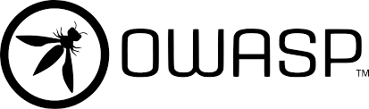

## world.hello();

👋 Hi there!

I’m a **Tech Strategist and Digital Transformation Expert** with over **15 years of experience** in the software and platforms industry. My journey spans advisory, business, and technology transformation, where I’ve honed my skills in software engineering, product management, web performance, cybersecurity, and immersive technologies.

💡 I thrive at the intersection of **innovation and execution**, helping organizations leverage cutting-edge technologies to drive growth, efficiency, and competitive advantage. Whether it’s building scalable software solutions, optimizing web performance, or securing digital ecosystems, I’m passionate about delivering impactful results.

### 🚀 What I Bring to the Table:

* Expertise in **strategic planning** and **digital transformation** initiatives. 🙎‍♂️
* Proven track record in **software engineering** and **product management**. 👨‍💻
* Deep knowledge of **web performance optimization** and **cybersecurity best practices**. ⚡🛡️
* Hands-on experience with **immersive technologies** (AR/VR) and emerging tech trends. 👨‍💻

### 🤝 Let’s Collaborate!

I’m open to **consulting opportunities**, **strategic partnerships**, and **cross-industry ventures**. If you’re working on innovative projects, exploring digital transformation, or need guidance on tech strategy, let’s connect and create something extraordinary!

---

## 🛠️ Technology Stack & Industry Experience

### Frontend Development

  
  
  
  
  
  
  

---

### Backend Technologies & Cloud Computing ☁️

  
  
  
  
  
  
  
  
  
  
  
  
  
  

---

### 🔒 Cybersecurity & Ethical Hacking 🛡️

  
  
  

#### 🔹 **Security Specialties:**

- 🔍 **Penetration Testing**
- 🛡️ **Ethical Hacking**
- 🛡️ **Defensive Security**
- 🌐 **Network Layer Security**
- 🔒 **Web Application Security**
- 🛠️ **Vulnerability Assessment**

---

## 🔥 Stats 🔥

  
  

---

## 🐍 Contribution Snake

<picture>
  <source media="(prefers-color-scheme: dark)" srcset="https://raw.githubusercontent.com/ramizebian/ramizebian/output/github-contribution-grid-snake-dark.svg" />
  <source media="(prefers-color-scheme: light)" srcset="https://raw.githubusercontent.com/ramizebian/ramizebian/output/github-contribution-grid-snake.svg" />
  
</picture>

---

## 🌐 Let's Connect!

Feel free to reach out to me through the following platforms:

  
  
  

